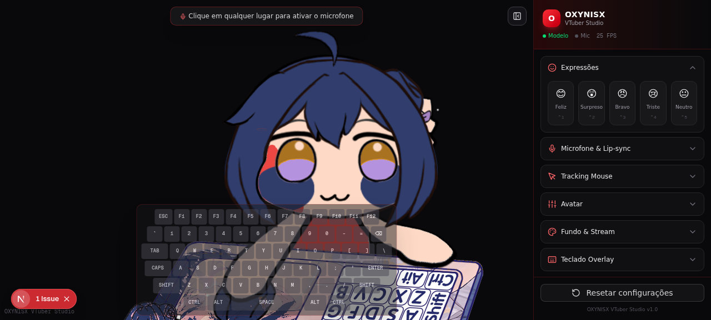

# 🎭 OXYNISX VTuber Studio

> A complete **VTuber studio** featuring **Ohto Ai** (red hoodie) as the avatar,
> with Live2D rendering, microphone lip-sync, mouse tracking, BongoCat-style
> keyboard overlay, and a **native Windows desktop app** (.exe) via Tauri.



---

## 🚀 Quick Start

### Option A: Download the Windows installer (easiest)

👉 https://github.com/Kronos1027/oxynisx-vtuber-studio/releases

Download `OXYNISX-VTuber_1.0.0_x64-setup.exe` and run it.

### Option B: Compile the .exe yourself

See **[BUILD-WINDOWS.md](BUILD-WINDOWS.md)** for detailed instructions.

Quick version (on Windows):
```powershell
git clone https://github.com/Kronos1027/oxynisx-vtuber-studio.git
cd oxynisx-vtuber-studio
bun install
bun run tauri:build
```

The `.exe` installer will be in `src-tauri/target/release/bundle/nsis/`.

### Option C: Run as web app (for development/testing)

```bash
bun install
bun run dev
```
Open `http://localhost:3000` in your browser.

---

## ✨ Features

### 🖥️ Desktop App (Tauri)
- **Native Windows .exe** — no browser needed
- **Transparent always-on-top window** — avatar floats over your games/streams
- **Click-through mode** — mouse passes through the avatar
- **Global keyboard shortcuts** — Ctrl+1..5 work even when other apps are focused
- **Window state persistence** — remembers position/size between sessions

### 🎤 Lip-Sync (Microphone)
- Real-time microphone capture via Web Audio API
- Volume-based mouth animation (SVG overlay)
- Adjustable sensitivity, threshold, and smoothing
- Device selector for choosing your microphone

### 🖱️ Mouse Tracking
- Head follows cursor (ParamAngleX/Y)
- Eyes follow cursor (ParamEyeBallX/Y)
- Adjustable range and smoothing
- Auto-blink and auto-breath idle animations

### 😊 Expressions
- 5 facial expressions: Happy, Surprised, Angry, Sad, Neutral
- Hotkeys: `Ctrl+1` through `Ctrl+5` (global in desktop mode)
- Toggle behavior (press again to clear)

### ⌨️ BongoCat Keyboard Overlay
- Visual keyboard showing pressed keys in real-time
- Full QWERTY layout with function keys
- Red highlight on key press
- Adjustable opacity

### 🎨 Customization
- Avatar scale, position (X/Y), and rotation
- Transparent background mode (for OBS capture)
- Custom background color
- Collapsible control panel

### 🎬 Streaming Ready
- Transparent window for OBS Window Capture
- Chroma key compatible
- Always-on-top keeps avatar visible during gameplay

---

## 🎮 Controls

| Key | Action |
|-----|--------|
| `Ctrl+1` | Expression: Happy |
| `Ctrl+2` | Expression: Surprised |
| `Ctrl+3` | Expression: Angry |
| `Ctrl+4` | Expression: Sad |
| `Ctrl+5` | Expression: Neutral |
| Mouse move | Head + eye tracking |
| 📌 button | Toggle always-on-top (desktop mode) |
| 🖱️ button | Toggle click-through (desktop mode) |

---

## 🏗️ Architecture

```
src/                              # Frontend (Next.js + React)
├── app/
│   ├── layout.tsx                # Root layout (loads Live2D Cubism Core)
│   └── page.tsx                  # Main VTuber stage + control panel
├── components/
│   └── vtuber/
│       ├── live2d-stage.tsx      # PIXI canvas + model rendering
│       ├── control-panel.tsx     # Settings sidebar
│       ├── mouth-overlay.tsx     # SVG lip-sync mouth
│       └── keyboard-overlay.tsx  # BongoCat-style keyboard
├── hooks/
│   ├── use-live2d.ts             # Live2D model management
│   ├── use-microphone.ts         # Web Audio API mic capture
│   ├── use-keyboard.ts           # Keyboard event capture
│   └── use-tauri.ts              # Tauri desktop integration
└── stores/
    └── vtuber-store.ts           # Zustand global state

src-tauri/                        # Backend (Rust + Tauri)
├── src/lib.rs                    # Window commands + global shortcuts
├── Cargo.toml                    # Rust dependencies
├── tauri.conf.json               # Window config (transparent, no decorations)
└── capabilities/default.json     # Permissions

public/
├── models/otho-ai/               # Live2D model files
└── live2dcubismcore.min.js       # Live2D Cubism 4 runtime
```

### Technology Stack
- **Desktop**: Tauri v2 (Rust backend + WebView2 frontend)
- **Framework**: Next.js 16 with App Router (static export)
- **Live2D**: pixi-live2d-display + Live2D Cubism 4 Core
- **Rendering**: PIXI.js v6
- **Audio**: Web Audio API (AnalyserNode)
- **State**: Zustand with localStorage persistence
- **UI**: shadcn/ui + Tailwind CSS

---

## 🎥 Using with OBS

### Method 1: Window Capture (recommended)
1. Start the OXYNISX VTuber Studio app
2. In OBS, add a **Window Capture** source
3. Select the "OXYNISX VTuber Studio" window
4. The transparent window background will show through automatically

### Method 2: Always-on-top overlay
1. Click the 📌 button in the app to enable always-on-top
2. The avatar floats over ALL windows (games, browsers, etc.)
3. In OBS, use **Display Capture** or **Window Capture** on the game

---

## 🎨 Character

The avatar is **Ohto Ai** from *Wonder Egg Priority*, wearing her signature red hoodie.

- **Hair**: Dark navy blue bob with ahoge
- **Eyes**: Heterochromatic (gold + blue)
- **Outfit**: Bright crimson red hoodie with sunflower accents
- **Base model**: doro (Live2D Cubism 4) with custom texture repaint

The model files are in `public/models/otho-ai/`.

---

## ⚠️ Limitations

- The base doro model doesn't have a `ParamMouthOpen` parameter, so lip-sync
  uses an SVG mouth overlay positioned over the face rather than a true
  Live2D mouth deformation.
- In browser mode (not desktop), keyboard capture only works when the browser
  window has focus. Use the desktop app for global shortcuts.
- Microphone requires user interaction to start (browser autoplay policy).

---

## 📝 License

- **Code**: MIT
- **Live2D Cubism Core**: Proprietary (Live2D Inc.)
- **Character**: Ohto Ai © A-1 Pictures / Aniplex

---

## 🛠️ Built for OXYNISX

This VTuber studio was custom-built for **OXYNISX** for live streaming.
